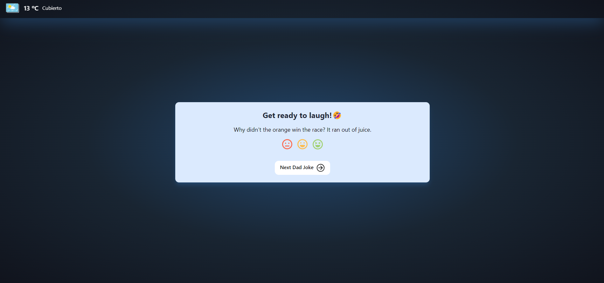

SPANISH V.

## 🌸 Descripción

Este proyecto forma parte de una serie de sprints realizados en IT Academy - Barcelona Activa.

Este Sprint corresponde al 04.

Objetivos: 
- Comprender el funcionamiento de una API.
- Conocer otras API gratuitas.

Los dos temas más importantes que pondrás en práctica en este proyecto son TypeScript y la obtención de datos mediante llamadas a API Rest a un servidor.

Una empresa de coaching está llevando a cabo un experimento en empresas de Barcelona, en el cual está midiendo el impacto del humor y la diversión en la productividad.Nos han pedido una aplicación web que muestre chistes a los empleados antes de comenzar la jornada laboral. Serás el encargado de llevar a cabo la base del proyecto para hacer una demo en dos semanas con el cliente y comenzar las pruebas con usuarios reales.





## 💻 Tecnologias usadas

- Tailwindcss: 3.4.3
- Typescript": 5.4.5

## 🎲 Recursos

Jokes APIs:
- https://icanhazdadjoke.com/
- https://api.chucknorris.io/

Weather API:
-https://www.el-tiempo.net/api

## ⚙️ Instalación

Para instalarlo en la computadora, debes seguir estos pasos:

1. Clona el repositorio

```bash
https://github.com/ImLauraGS/typescript_API.git
``` 
2. Instalar dependencias.

```bash
npm install
``` 
3. Instalar Typescript.

```bash
npm install -g typescript
``` 
4. Compilar Typescript.

```bash
npx tsc -w
``` 

5. Compilar Tailwind.

```bash
npm run build
``` 

## 🔗 Autora

 
Laura G. 
[LinkedIn](https://www.linkedin.com/in/laura-gil-solano/)


_______________________________________________________________________

ENGLISH V.

## 🌸 Description

This project is part of a series of sprints carried out at IT Academy - Barcelona Activa.

This Sprint corresponds to 04.

Objectives:

- Understanding how an API works.
- Knowing about other free APIs.

The two most important topics you will put into practice in this project are TypeScript and obtaining data through API Rest calls to a server.

A coaching company is conducting an experiment in Barcelona-based companies, in which it is measuring the impact of humor and fun on productivity. They have asked for a web application that displays jokes to employees before starting the workday. You will be responsible for carrying out the foundation of the project to present a demo in two weeks with the client and start testing with real users.


 

## 💻 Technologies Used

- Tailwindcss: 3.4.3
- Typescript: 5.4.5


## ⚙️ Installation
 To install it on your computer, follow these steps:

 1. Clone the repository

 ```bash
https://github.com/ImLauraGS/typescript_API.git
``` 

2. Install dependencies.

```bash
npm install
``` 

3. Install Typescript.

```bash
npm install -g typescript
``` 

4. Compile Typescript.

```bash
npx tsc -w
``` 

5. Compile Tailwind.

```bash
npm run build
``` 
 
## 🔗 Author
  
 Laura G. 
 [LinkedIn](https://www.linkedin.com/in/laura-gil-solano/)